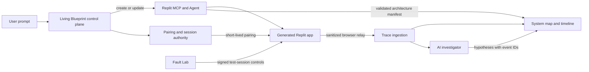

# Design: Living Blueprint

Generated by /office-hours on 2026-08-18  
Branch: main  
Repo: ArS377/app-creator  
Status: APPROVED, revised for the public Replit MCP on 2026-08-18
Mode: Builder

## Problem statement

AI app builders can produce working software from a prompt, but the result is hard to inspect. A user can click through the interface without knowing which component handled the action, which API route ran, which database operation committed or failed, why a failure occurred, or how a later prompt changed the architecture.

Living Blueprint turns a generated Replit app into an explorable system. The user creates an app from a prompt, uses it inside a control room, and watches each interaction move through the frontend, API, database, AI calls, and WebSocket connections. The user can inject a labeled test failure, replay the resulting trace, and inspect an AI diagnosis tied to specific evidence.

## What makes this cool

The product has one five-step loop:

1. The user describes an app.
2. The user tries the working Replit app and watches one action cross the system map.
3. Fault Lab introduces a controlled failure and the user repeats the action.
4. The investigator identifies the first abnormal event and cites the trace evidence.
5. The user changes the prompt. Replit updates the app, and the map compares the stored architecture snapshots.

Runtime events separate Living Blueprint from an animated architecture diagram. The events come from the running app. The build view uses high-level status and a post-build architecture manifest because Replit MCP does not expose Agent's private generation stream.

## Constraints

- The main product and generated apps use Replit. The main product is a published Replit App. Authenticated generation depends on a successful MCP OAuth spike.
- Version 0 uses one prepared Replit research app, one traced action, and one database failure. It does not create apps for visitors.
- Version 1 accepts product prompts within a supported capability envelope. Replit Agent creates each app from an instrumentation contract included in the prompt. The control plane verifies the result after creation and every update.
- Version 1 supports apps created through Living Blueprint. It does not analyze arbitrary repositories or every framework.
- Runtime events must be observed, correlated, and sanitized. The product must not capture secrets, cookies, authorization headers, raw form values, database rows, or AI prompt contents.
- Build-stage visuals must represent confirmed milestones and the resulting architecture. They must not imply access to Replit Agent's hidden reasoning.
- Faults are explicit simulations, limited to the current test session, and automatically cleared.
- The interface should feel professional and approachable. It should avoid game mechanics, neon cyberpunk styling, glass panels, decorative charts, and a grid of generic dashboard cards.
- The first public demo should teach the concept before requiring Replit authentication. Its build and update stages are labeled replays; its app interaction, fault, trace, and diagnosis are live.
- Autonomous code repair, multiplayer debugging, mobile apps, production monitoring, and arbitrary-stack instrumentation are outside the first version.

## Premises

1. The public Replit MCP currently exposes `create_app_from_prompt`, `update_app_using_prompt`, and `ask_question`. Creation returns a Repl ID and editor URL. It does not accept a source Repl, publish an app, or report publication status.
2. Replit MCP does not document file-by-file build events or a tool for installing per-app secrets. Those are product limits, not implementation details.
3. The generation prompt defines the supported stack and tracing contract. `ask_question` and runtime evidence verify whether Agent preserved that contract during creation and one update.
4. Agent can return an architecture description through `ask_question`, but that result is inferred. Schema validation proves its shape, not its truth. Runtime evidence must confirm nodes when possible.
5. The generated app can send sanitized events to the control plane only after the project proves tenant-scoped credential provisioning outside Agent prompts and client code.
6. The investigator is useful only when its cited events support its diagnosis. Citation existence alone is not enough.
7. A prepared tutorial app is necessary. Generation latency and OAuth setup should not block a first-time visitor from understanding the project.

Technical source: [Replit MCP Server documentation](https://docs.replit.com/platforms/mcp-server)

## Approaches considered

### Approach A: Architecture playback

Effort: small  
Risk: low

Generate the app, ask Replit Agent for an architecture description, and animate the returned manifest.

Pros:

- It reaches a visual demo quickly.
- It needs little or no runtime instrumentation.
- It works as an explainer after generation.

Cons:

- It cannot support evidence-based debugging.
- It can drift from the app's behavior.
- Fault Lab and causal replay would be staged rather than observed.

### Approach B: Instrumented runtime

Effort: large  
Risk: medium  
Decision: selected

Generate every app on a supported stack with a tracing module. Stream correlated runtime events into the control room, then use those events for playback, fault testing, and AI diagnosis.

Pros:

- The system map reflects what the app did.
- The trace can support debugging instead of explanation alone.
- Fault Lab produces repeatable demonstrations.
- Prompt updates can produce architecture diffs between stored manifest snapshots.

Cons:

- Instrumentation must survive Agent updates.
- Cross-origin embedding and event transport need an early feasibility test.
- Privacy rules must be enforced in code, not left to the AI investigator.

### Approach C: Universal analyzer

Effort: extra large  
Risk: high

Accept any Replit app, parse its code, infer the architecture, and add framework-specific instrumentation.

Pros:

- It could work with existing apps.
- It would support more frameworks over time.
- It would have value beyond apps created through the product.

Cons:

- Static analysis across arbitrary stacks is a separate product.
- Automatic code modification raises trust and compatibility problems.
- The first demo would spend more effort on coverage than on the visual debugging loop.

## Recommended approach

Build Approach B in two releases. Version 0 proves live tracing and evidence-linked diagnosis with one prepared Replit app. Version 1 adds authenticated creation, prompt updates, manifest snapshots, and runtime pairing for generated apps. Approach A supplies an inferred post-build manifest. Approach C stays out of scope.

### Delivery gates

Version 0 ships first:

- one prepared collaborative research app
- one `Save finding` action
- one database-write failure
- live runtime tracing and replay
- one investigator diagnosis tied to event IDs
- recorded, labeled build and update stages for the tutorial

User-generated apps remain blocked until these tests pass:

1. The control plane completes MCP OAuth with PKCE and keeps Replit tokens encrypted on the server.
2. Agent creates an app with the tracing bridge and keeps it after one `update_app_using_prompt` call.
3. The one-time browser pairing flow rejects the wrong origin, expired codes, and reused codes.
4. Manifest extraction returns strict schema version 1 JSON or a visible invalid state.
5. The complete frame or synchronized top-level-window handshake passes in current Chrome, Safari, and Firefox.
6. The interface sends the user to the returned Replit editor URL for build completion and publication. It never claims that Living Blueprint published the app.

Server-side trace relay remains unavailable until Replit exposes safe secret provisioning. Version 1 uses a short-lived, telemetry-only browser pairing token delivered after strict origin checks. It never places OAuth tokens, persistent credentials, or user data in Agent prompts.

### System design



The control plane has seven responsibilities:

1. Authenticate the user with Replit through the MCP OAuth flow.
2. Call `create_app_from_prompt` with the product brief and the supported instrumentation contract.
3. Issue short-lived, single-use runtime pairing codes without exposing Replit credentials.
4. Obtain, label, and validate an inferred architecture manifest after creation or update.
5. Receive sanitized runtime events and group them into traces.
6. Run the investigator against the manifest and selected trace.
7. Call `update_app_using_prompt`, request a fresh manifest, and calculate the snapshot diff.

### Supported capability envelope

Version 1 supports one documented stack:

- React actions wrapped with the Living Blueprint browser helper
- Express handlers with trace middleware and `AsyncLocalStorage`
- Postgres access through the instrumented `pg` wrapper
- WebSocket messages through the instrumented `ws` wrapper
- one named AI SDK adapter, selected during the feasibility spike

Prompts that require mobile output, serverless functions, a different database client, a different backend framework, or an unsupported real-time library must be rejected or generated with those areas marked unobserved. Fault controls appear only for modules that the manifest and health check confirm.

### Generated app contract

Every generated app starts from the same instrumented source Repl. Its contract is fixed:

- Start a root span only for an explicitly wrapped UI action, navigation, scheduled job, or server-initiated message.
- Use W3C `traceparent` for HTTP propagation, `AsyncLocalStorage` inside Express, wrapper calls around `pg`, and a trace field in WebSocket envelopes.
- Keep overlapping actions in separate trace contexts. Background work starts a `background.job` root when it has no parent.
- Emit timestamps, duration, event type, normalized route template, status, error class, service ID, and parent event ID.
- Record AI provider, model, latency, and token counts without recording prompt or response contents.
- Drop request bodies, response bodies, cookies, authorization headers, database values, query-string values, raw paths, error messages, and environment variables before transmission.
- Accept fault controls only when the request has a signed, single-use command for the active test session.
- Keep instrumentation active after a Replit Agent update. The update prompt must restate this rule, and a health check must verify it before the new version is shown.

The starter exposes Express, `pg`, `ws`, and the selected AI SDK only through instrumented adapter modules. Lint and build rules reject direct imports outside those adapters. After every Agent update, contract checks scan imports, enumerate Express routes, exercise each supported adapter, and compare adapter coverage with the manifest. The health endpoint reports coverage per subsystem. If coverage cannot be proved for one subsystem, every node in that subsystem is marked unobserved and its Fault Lab controls remain hidden.

### Cross-app trust and data lifecycle

The browser relay never receives a Replit OAuth token or a persistent app credential. It receives a short-lived trace token only after a one-time pairing exchange. Its claims bind `projectId`, `versionId`, `sessionId`, the exact runtime origin, ingestion scope, expiry, and nonce.

Pairing codes are single-use and expire after five minutes. Trace tokens expire after the current observation session and can only submit allowlisted telemetry. Project deletion, Replit disconnect, or a user security action revokes every open pairing for that project. A later Replit API for production secret provisioning may add authenticated server spans, but Version 1 does not assume it exists.

### Browser and session handshake

The control plane creates an isolated session record and a single-use, 128-bit exchange code. The session record binds the project, version, exact generated-app origin, control-room browser session, and a five-minute expiry.

The handshake is exact:

1. The generated app frame sends `lb.ready` with `postMessage`.
2. The control room verifies `event.origin` and `event.source`, then returns the single-use exchange code with strict-origin `postMessage`.
3. The frame sends the code to the control plane exchange route and includes its current origin.
4. The control plane verifies the code, browser session, project, version, origin, expiry, and single-use state.
5. The exchange returns a short-lived token limited to WebSocket trace ingestion.
6. The generated bridge sends allowlisted browser events directly to the control plane. The ingestion service sanitizes them again before storage.

Fault state is keyed by the isolated session ID, not by the shared sample app. A fault enabled by one tutorial visitor cannot affect another visitor.

The preview gate tests the complete message and token handshake in the current stable Chrome, Safari, and Firefox releases. If framing is blocked, Living Blueprint opens the app in a top-level synchronized window and runs the same strict-origin handshake through `window.opener`. The fallback refuses to run when the opener or origin does not match.

The ingestion service verifies signatures, app ownership, scope, expiry, event IDs, schema size, and quotas before storage. Fault commands use a single-use nonce. Duplicate event IDs are idempotent. Storage is partitioned by `userId` and `appId`.

Initial limits are concrete:

- 4 KB per event
- 256 events per trace
- 50 stored traces per session
- 25 events per second per app, with a short burst of 100
- 1 MB or 500 events in the generated app's local retry queue, evicting the oldest events first
- 24-hour retention for anonymous tutorial sessions
- 7-day retention for authenticated sessions, with immediate user-triggered deletion
- 5-minute token lifetime

All metadata uses an allowlist. Database events may include operation type, normalized table name, affected-row count, transaction outcome, and schema migration ID. They never include SQL text, parameters, row values, or database error messages. Route names, service IDs, table names, and error codes are normalized and length-limited before storage.

### Published-app access policy

Living Blueprint cannot publish through the current public MCP. The user opens the returned Replit editor URL and controls publication there. Before creation, the interface warns the user not to put credentials or private data in the prompt. It never claims that a Repl is private or that an editor URL is a published app.

### Architecture manifest

After Replit creates or updates an app, the control plane asks Agent for JSON that follows manifest schema version 1. The manifest contains:

- UI components and their important actions
- API routes and handlers
- database tables and named operations
- AI integrations
- WebSocket channels
- directed connections between those nodes
- source-file references for inspection

Each node has a deterministic ID such as `route:POST:/findings`, `table:public.findings`, or `component:src/features/findings/FindingEditor.tsx#FindingEditor:save`. Each edge ID joins its normalized source, relationship, and target. A node also records `evidence: agent_declared | runtime_observed` and an optional source-file reference.

The control plane validates the JSON, rejects unknown fields, caps it at 200 nodes and 400 edges, and displays an incomplete-state warning if Agent cannot produce a valid result. Runtime spans upgrade matching nodes to `runtime_observed`. Agent-only nodes use a dashed style and remain labeled as inferred.

Manifest snapshots are canonicalized by sorting IDs and hashing structural fields. The structural hash excludes `evidence` and `sourceFile`. A rename appears as one removal and one addition. A node is changed only when its canonical manifest metadata changes. Evidence upgrades appear as a separate overlay, not as architecture changes. The design does not claim to detect internal code changes when the manifest metadata and edges remain the same. The update flow compares stored snapshots because `update_app_using_prompt` mutates the existing app; it does not assume that both versions remain live.

Component IDs include their normalized module path, export, and action: `component:src/features/findings/FindingEditor.tsx#FindingEditor:save`. Route IDs use the normalized method and route template. Edge relationships are limited to `calls`, `reads`, `writes`, `publishes`, `subscribes`, `renders`, and `invokes`.

Manifest schema version 1:

```json
{
  "$schema": "https://json-schema.org/draft/2020-12/schema",
  "$id": "https://livingblueprint.dev/schemas/manifest-v1.json",
  "type": "object",
  "additionalProperties": false,
  "required": ["schemaVersion", "appId", "versionId", "nodes", "edges"],
  "properties": {
    "schemaVersion": { "const": "1" },
    "appId": { "type": "string", "format": "uuid" },
    "versionId": { "type": "string", "format": "uuid" },
    "nodes": {
      "type": "array",
      "maxItems": 200,
      "items": {
        "type": "object",
        "additionalProperties": false,
        "required": ["id", "kind", "label", "evidence"],
        "properties": {
          "id": { "type": "string", "minLength": 3, "maxLength": 384 },
          "kind": { "enum": ["component", "route", "table", "ai", "websocket", "job"] },
          "label": { "type": "string", "minLength": 1, "maxLength": 80 },
          "evidence": { "enum": ["agent_declared", "runtime_observed"] },
          "modulePath": { "type": "string", "maxLength": 180 },
          "exportName": { "type": "string", "maxLength": 80 },
          "actionName": { "type": "string", "maxLength": 80 },
          "method": { "enum": ["GET", "POST", "PUT", "PATCH", "DELETE"] },
          "routeTemplate": { "type": "string", "maxLength": 160 },
          "sourceFile": { "type": "string", "maxLength": 240 }
        },
        "allOf": [
          {
            "if": { "properties": { "kind": { "const": "component" } } },
            "then": { "required": ["modulePath", "exportName", "actionName"] }
          },
          {
            "if": { "properties": { "kind": { "const": "route" } } },
            "then": { "required": ["method", "routeTemplate"] }
          }
        ]
      }
    },
    "edges": {
      "type": "array",
      "maxItems": 400,
      "items": {
        "type": "object",
        "additionalProperties": false,
        "required": ["id", "sourceId", "targetId", "relationship", "evidence"],
        "properties": {
          "id": { "type": "string", "maxLength": 800 },
          "sourceId": { "type": "string", "maxLength": 384 },
          "targetId": { "type": "string", "maxLength": 384 },
          "relationship": { "enum": ["calls", "reads", "writes", "publishes", "subscribes", "renders", "invokes"] },
          "evidence": { "enum": ["agent_declared", "runtime_observed"] }
        }
      }
    }
  }
}
```

Schema validation is followed by semantic validation:

- Node and edge IDs must be unique.
- Every edge endpoint must reference an existing node.
- Edge IDs must equal the canonical `sourceId|relationship|targetId` value.
- `renders` connects component to component. `reads` and `writes` end at a table. `publishes` and `subscribes` connect to a WebSocket node. `calls` and `invokes` must match an allowed source and target kind from the supported capability envelope.
- Component, route, table, and edge IDs must match their canonical syntax.
- Source paths must use repository-relative POSIX syntax. Absolute paths, backslashes, empty segments, and `..` are rejected.

### Runtime event model

An event has `schemaVersion`, `appId`, `versionId`, `sessionId`, `traceId`, `eventId`, `parentEventId`, `kind`, `serviceId`, `startedAt`, `durationMs`, `status`, and a small allowlisted metadata object. Event kinds are:

- `ui.action`
- `http.client`
- `http.server`
- `db.query`
- `ai.call`
- `ws.publish`
- `ws.receive`
- `error`
- `fault.applied`
- `background.job`

Runtime event schema version 1 uses W3C trace and span ID formats. Every event is capped at 4 KB after JSON serialization.

```json
{
  "$schema": "https://json-schema.org/draft/2020-12/schema",
  "$id": "https://livingblueprint.dev/schemas/event-v1.json",
  "$defs": {
    "spanId": { "type": "string", "pattern": "^[0-9a-f]{16}$" },
    "traceId": { "type": "string", "pattern": "^[0-9a-f]{32}$" },
    "base": {
      "type": "object",
      "additionalProperties": false,
      "required": ["schemaVersion", "appId", "versionId", "sessionId", "traceId", "eventId", "parentEventId", "kind", "serviceId", "startedAt", "durationMs", "status", "metadata"],
      "properties": {
        "schemaVersion": { "const": "1" },
        "appId": { "type": "string", "format": "uuid" },
        "versionId": { "type": "string", "format": "uuid" },
        "sessionId": { "type": "string", "format": "uuid" },
        "traceId": { "$ref": "#/$defs/traceId" },
        "eventId": { "$ref": "#/$defs/spanId" },
        "parentEventId": { "oneOf": [{ "$ref": "#/$defs/spanId" }, { "type": "null" }] },
        "kind": { "enum": ["ui.action", "http.client", "http.server", "db.query", "ai.call", "ws.publish", "ws.receive", "error", "fault.applied", "background.job"] },
        "serviceId": { "type": "string", "pattern": "^[a-z0-9][a-z0-9._:-]{0,79}$" },
        "spanName": { "type": "string", "minLength": 1, "maxLength": 100 },
        "startedAt": { "type": "string", "format": "date-time" },
        "durationMs": { "type": "integer", "minimum": 0, "maximum": 900000 },
        "status": { "enum": ["ok", "error", "cancelled"] },
        "metadata": { "type": "object" }
      }
    },
    "uiAction": {
      "type": "object",
      "additionalProperties": false,
      "required": ["actionName", "componentId"],
      "properties": {
        "actionName": { "type": "string", "minLength": 1, "maxLength": 80 },
        "componentId": { "type": "string", "minLength": 3, "maxLength": 384 }
      }
    },
    "http": {
      "type": "object",
      "additionalProperties": false,
      "required": ["method", "routeTemplate", "statusCode"],
      "properties": {
        "method": { "enum": ["GET", "POST", "PUT", "PATCH", "DELETE"] },
        "routeTemplate": { "type": "string", "minLength": 1, "maxLength": 160 },
        "statusCode": { "type": "integer", "minimum": 100, "maximum": 599 }
      }
    },
    "database": {
      "type": "object",
      "additionalProperties": false,
      "required": ["operation", "tableName", "affectedRowCount", "transactionOutcome"],
      "properties": {
        "operation": { "enum": ["select", "insert", "update", "delete", "transaction"] },
        "tableName": { "type": "string", "pattern": "^[a-zA-Z_][a-zA-Z0-9_.]{0,127}$" },
        "affectedRowCount": { "type": "integer", "minimum": 0, "maximum": 1000000000 },
        "transactionOutcome": { "enum": ["none", "commit", "rollback"] },
        "migrationId": { "type": "string", "maxLength": 80 }
      }
    },
    "ai": {
      "type": "object",
      "additionalProperties": false,
      "required": ["provider", "model", "inputTokens", "outputTokens"],
      "properties": {
        "provider": { "type": "string", "minLength": 1, "maxLength": 40 },
        "model": { "type": "string", "minLength": 1, "maxLength": 80 },
        "inputTokens": { "type": "integer", "minimum": 0, "maximum": 10000000 },
        "outputTokens": { "type": "integer", "minimum": 0, "maximum": 10000000 }
      }
    },
    "websocket": {
      "type": "object",
      "additionalProperties": false,
      "required": ["channelName", "messageType"],
      "properties": {
        "channelName": { "type": "string", "minLength": 1, "maxLength": 80 },
        "messageType": { "type": "string", "minLength": 1, "maxLength": 80 }
      }
    },
    "error": {
      "type": "object",
      "additionalProperties": false,
      "required": ["errorClass", "errorCode"],
      "properties": {
        "errorClass": { "type": "string", "minLength": 1, "maxLength": 80 },
        "errorCode": { "type": "string", "minLength": 1, "maxLength": 80 }
      }
    },
    "fault": {
      "type": "object",
      "additionalProperties": false,
      "required": ["faultType", "targetNodeId"],
      "properties": {
        "faultType": { "enum": ["db.reject", "http.delay", "ws.delay", "ai.malformed"] },
        "targetNodeId": { "type": "string", "minLength": 3, "maxLength": 384 },
        "delayMs": { "type": "integer", "minimum": 0, "maximum": 10000 }
      }
    },
    "background": {
      "type": "object",
      "additionalProperties": false,
      "required": ["jobName"],
      "properties": { "jobName": { "type": "string", "minLength": 1, "maxLength": 80 } }
    }
  },
  "oneOf": [
    { "allOf": [{ "$ref": "#/$defs/base" }, { "properties": { "kind": { "const": "ui.action" }, "metadata": { "$ref": "#/$defs/uiAction" } } }] },
    { "allOf": [{ "$ref": "#/$defs/base" }, { "properties": { "kind": { "const": "http.client" }, "parentEventId": { "$ref": "#/$defs/spanId" }, "metadata": { "$ref": "#/$defs/http" } } }] },
    { "allOf": [{ "$ref": "#/$defs/base" }, { "properties": { "kind": { "const": "http.server" }, "parentEventId": { "$ref": "#/$defs/spanId" }, "metadata": { "$ref": "#/$defs/http" } } }] },
    { "allOf": [{ "$ref": "#/$defs/base" }, { "properties": { "kind": { "const": "db.query" }, "parentEventId": { "$ref": "#/$defs/spanId" }, "metadata": { "$ref": "#/$defs/database" } } }] },
    { "allOf": [{ "$ref": "#/$defs/base" }, { "properties": { "kind": { "const": "ai.call" }, "parentEventId": { "$ref": "#/$defs/spanId" }, "metadata": { "$ref": "#/$defs/ai" } } }] },
    { "allOf": [{ "$ref": "#/$defs/base" }, { "properties": { "kind": { "const": "ws.publish" }, "metadata": { "$ref": "#/$defs/websocket" } } }] },
    { "allOf": [{ "$ref": "#/$defs/base" }, { "properties": { "kind": { "const": "ws.receive" }, "parentEventId": { "$ref": "#/$defs/spanId" }, "metadata": { "$ref": "#/$defs/websocket" } } }] },
    { "allOf": [{ "$ref": "#/$defs/base" }, { "properties": { "kind": { "const": "error" }, "parentEventId": { "$ref": "#/$defs/spanId" }, "metadata": { "$ref": "#/$defs/error" } } }] },
    { "allOf": [{ "$ref": "#/$defs/base" }, { "properties": { "kind": { "const": "fault.applied" }, "parentEventId": { "$ref": "#/$defs/spanId" }, "metadata": { "$ref": "#/$defs/fault" } } }] },
    { "allOf": [{ "$ref": "#/$defs/base" }, { "required": ["spanName"], "properties": { "kind": { "const": "background.job" }, "metadata": { "$ref": "#/$defs/background" } } }] }
  ]
}
```

Root events may include an allowlisted `spanName`. Scheduled and server-initiated work use `background.job` with a normalized `spanName` such as `background.daily-summary`. Navigation uses `ui.action` with an action name such as `navigation:/room/:id`.

The control plane stores events in arrival order and reconstructs causal order from parent IDs. The occurrence-to-display target is under one second at the 95th percentile during the sample flow. Late events can join the existing trace without changing earlier event IDs. A truncated trace keeps its first and last events, inserts a visible gap marker, and never asks the investigator to infer across that gap.

### Fault Lab

Version 0 supports one transparent fault: reject the sample app's `INSERT` operation before it reaches Postgres. The resulting path is `ui.action` to `http.client` to `http.server` to `fault.applied` to failed `db.query` to HTTP error to UI error. It does not depend on WebSocket timing.

Version 1 may add API or WebSocket latency and malformed AI responses after the health check confirms those modules. A persistent banner names the active simulation. Each fault expires after five minutes, applies only to the selected test session, and emits `fault.applied`. Shared or production traffic cannot activate it.

### AI investigator

The investigator receives the validated manifest and one sanitized trace. It returns structured JSON with up to three hypotheses. Each hypothesis has a short title, a `high`, `medium`, or `low` confidence value, an explanation, the first abnormal event ID, and supporting event IDs.

The interface renders those IDs as links. Selecting one moves the timeline and system map to the same event. The control plane rejects a hypothesis that cites a missing ID.

Golden traces test correctness, not citation presence. Each supported fault has an expected first abnormal event, root-cause category, and required evidence set. Tests also include an incomplete trace whose correct result is `insufficient_evidence`. Version 0 must pass every sample and insufficient-evidence case before the investigator appears in the public tutorial.

Investigator response schema version 1:

```json
{
  "$schema": "https://json-schema.org/draft/2020-12/schema",
  "$id": "https://livingblueprint.dev/schemas/investigation-v1.json",
  "type": "object",
  "additionalProperties": false,
  "required": ["schemaVersion", "result", "hypotheses"],
  "properties": {
    "schemaVersion": { "const": "1" },
    "result": { "enum": ["hypotheses", "insufficient_evidence"] },
    "explanation": { "type": "string", "maxLength": 400 },
    "hypotheses": {
      "type": "array",
      "maxItems": 3,
      "items": {
        "type": "object",
        "additionalProperties": false,
        "required": ["title", "confidence", "explanation", "firstAbnormalEventId", "supportingEventIds"],
        "properties": {
          "title": { "type": "string", "minLength": 1, "maxLength": 100 },
          "confidence": { "enum": ["high", "medium", "low"] },
          "explanation": { "type": "string", "minLength": 1, "maxLength": 600 },
          "firstAbnormalEventId": { "type": "string", "minLength": 1, "maxLength": 80 },
          "supportingEventIds": {
            "type": "array",
            "minItems": 1,
            "maxItems": 12,
            "uniqueItems": true,
            "items": { "type": "string", "maxLength": 80 }
          }
        }
      }
    }
  },
  "allOf": [
    {
      "if": { "properties": { "result": { "const": "insufficient_evidence" } } },
      "then": {
        "required": ["explanation"],
        "properties": { "hypotheses": { "maxItems": 0 } }
      }
    },
    {
      "if": { "properties": { "result": { "const": "hypotheses" } } },
      "then": { "properties": { "hypotheses": { "minItems": 1 } } }
    }
  ]
}
```

The investigator does not edit code in the first version. An automated fix and verification loop is a later extension.

### Prompt update and architecture diff

In Version 1, the user edits the original prompt and submits the change through `update_app_using_prompt`. The control plane keeps the old manifest snapshot while Replit mutates the app. Once the user confirms Agent finished, the control plane validates a new manifest and compares stored nodes and edges by deterministic IDs.

The diff has three states:

- added nodes and connections
- removed nodes and connections
- changed nodes whose canonical manifest metadata or relationships differ

The user can switch between before, after, and overlay views. Only the current version is live. Stored traces carry `versionId` and remain separate so the interface does not imply that old behavior belongs to the new build.

### App lifecycle

The control plane uses these states: `draft`, `creating`, `agent_working`, `inspecting`, `needs_replit`, `observable`, `updating`, `failed`.

Before each create or update, the control plane creates an immutable version ID in `pending` state. The instrumentation contract includes that identifier. A failed update leaves the previous version record active and marks the pending record failed.

`replUrl` opens the Replit project editor. The user may add a published app URL after deploying in Replit. The control plane marks the project `observable` only after a valid manifest exists and the exact runtime origin completes a pairing handshake.

Replit MCP has no documented create-status or update-status tool. Creation and update therefore stop at `agent_working` after the tool returns a Repl ID. The user confirms that Agent finished, then Living Blueprint uses `ask_question` to request a manifest. A valid manifest and a successful runtime pairing are separate signals and stay separate in the interface.

Each operation has a visible last-known state and a manual inspection action. MCP timeout errors are recorded as unknown outcomes and are never retried automatically because a duplicate call could create a second app. Updates replace the current app. Living Blueprint stores old manifests and traces as snapshots rather than promising a second live URL.

## Interface and tutorial

The approved layout has three synchronized work areas and a bottom timeline:

- App preview: the generated app runs on the left.
- System map: the selected action moves through frontend, API, data, AI, and WebSocket nodes in the center.
- Diagnosis: the investigator shows ranked causes and evidence on the right.
- Timeline and Fault Lab: the bottom area controls replay and test failures.

The first-run tutorial uses a prepared collaborative research app. It takes about 60 seconds and does not require setup:

1. A labeled replay shows Replit creating the sample app from its prompt.
2. The visitor clicks `Save finding` and watches the successful live trace.
3. The visitor enables `Reject database write` and repeats the action.
4. The investigator links the failure to the injected database event using the live trace.
5. A labeled replay shows a prompt update and the stored manifest diff.

A thin strip remains visible after onboarding: Watch build replay, use the app, test a failure, follow the evidence, watch update replay. Version 0 shows the sample prompt as read-only and does not offer live generation. The `How it works` button reopens the tutorial.

The interface uses warm neutrals with functional color:

- purple for frontend and UI nodes
- orange for API routes
- teal for data and successful flow
- red for errors and active fault paths
- warm yellow for the selected trace context

Color never carries meaning by itself. Labels, line styles, icons, and text states must preserve the same information for color-blind users.

Approved wireframe: `/Users/aryasomasundaram/Documents/Codex/2026-08-18/i-wa/work/living-blueprint-wireframe-tutorial.png`

## Key states and edge cases

- Generation running: show only confirmed states such as request sent, `replUrl` received, manifest validated, runtime origin paired, and first trace observed.
- Generation failed: keep the prompt, show Replit's returned error, and allow a retry.
- Invalid manifest: open the app preview but mark the system map as incomplete.
- Instrumentation missing after update: hide the new runtime map until the health check passes or Agent restores the tracing module.
- Trace has late or missing events: show the known path and label the gap. Do not invent a connection.
- Investigator has weak evidence: show low confidence or no diagnosis.
- Event transport disconnects: buffer up to 1 MB or 500 events, evict the oldest events first, reconnect, and mark the affected time range.
- Preview cannot load in a frame: open the generated app in a separate window while keeping the trace synchronized.
- Long generation time: let the user leave and return to the session URL.
- Tutorial sample is unavailable: fall back to a recorded trace and label it as a replay.

## Open questions and go/no-go tests

1. MCP OAuth: can the published control plane complete protected-resource discovery and keep Replit tokens server-side? Pass means one test user can reconnect without exposing a token to the browser.
2. Browser pairing: does the short-lived trace token stay limited to one project, origin, browser session, and five-minute window?
3. Pairing lifecycle: do expiry, single-use exchange, disconnect, and project deletion prevent further ingestion?
4. Prompt preservation: does the instrumentation contract survive creation and one update? Pass requires manifest checks and observed browser events.
5. Preview: does the full frame or synchronized top-level-window `postMessage` handshake pass in current Chrome, Safari, and Firefox?
6. Replit handoff: does the product consistently distinguish the editor URL from a published runtime URL?
7. Async readiness: do three creates and three updates avoid duplicate MCP calls after timeouts?
8. Manifest accuracy: what percentage of Agent-declared nodes can runtime evidence confirm on the sample and three generated apps?
9. Investigator model: which available model passes every golden trace under the chosen latency and cost limit?

Tests 1 through 7 are architectural gates. Version 1 does not start until they pass or the document records the stated fallback.

## Success criteria

Version 0 is done when all of the following are true:

- The prepared tutorial works without Replit authentication.
- At least four of five first-time viewers can explain the five-step product loop after the tutorial without extra help.
- Clicking `Save finding` produces one correlated trace across UI, HTTP, and database events.
- Runtime events appear in the control room within one second of occurrence at the 95th percentile during the sample flow.
- The database-write fault is labeled, session-scoped, reversible, and visible in the timeline.
- The one-time-code handshake rejects the wrong origin, an expired code, and a reused code. Ten simultaneous tutorial sessions do not share fault state or trace data.
- The investigator passes every golden trace, including the insufficient-evidence case.
- Automated redaction tests confirm that no secret, cookie, authorization header, raw form value, database value, or AI content reaches event storage.
- Event-size, trace-size, quota, retention, tenant-isolation, deletion, and anti-replay tests pass.
- The stored before-and-after sample manifests produce the expected architecture diff.
- The complete demo can be recorded in under three minutes without manual repair between steps.

Version 1 is done when the delivery gates pass and one authenticated user can create an app, finish it in Replit, connect its runtime, trace it, revoke pairing, fault-test it, submit one update, and inspect a correct snapshot diff inside the supported capability envelope.

## Distribution plan

Living Blueprint ships from `/Users/aryasomasundaram/Documents/Github/app-creator` as a published Replit App. The public URL opens the tutorial sample immediately. Users connect their Replit account only in Version 1, when they choose to generate an app.

The control plane, trace ingestion service, investigator, session database, and frontend live in the main Replit project. Generated apps live in the user's Replit workspace and send allowlisted events back to the control plane. A deployment check should run the tutorial trace, validate the manifest schema, and confirm that redaction tests still pass before publishing a new version.

The first release does not need a browser extension, desktop app, package registry, or separate cloud account.

## Next steps

1. Build Version 0 around the prepared research app, one correlated trace, one database-write fault, and the fixed control-room layout.
2. Add the five-step tutorial with labeled creation and update replays, then test it with five first-time viewers.
3. Add the investigator only after the golden-trace suite passes.
4. Run the delivery-gate tests for OAuth, pairing lifecycle, prompt-contract preservation, preview behavior, Replit handoff, and async readiness.
5. If the gates pass, add authenticated generation within the supported capability envelope.
6. Add update snapshots and architecture comparison, deploy the control plane on Replit, and record the three-minute demo.

## Appendix: session notes

### The assignment

Show the tutorial wireframe to one person who has used an AI app builder. Do not explain it first. Ask them to describe what the product does and what they would click next. Write down the first part they misunderstand.

### What I noticed about how you think

- You rejected the first direction because it felt "too business like" and asked to restart the brainstorm. That kept the project focused on curiosity and craft instead of a generic productivity pitch.
- You kept returning to "professional not gamy." That constraint shaped the living blueprint into a debugging interface rather than a code city.
- When the control room still felt unclear, you asked for a tutorial instead of adding more labels to the same screen. The first-run sample now teaches the product through one complete action.
- "More colorful and user friendly" did not mean adding decoration. Color now explains which part of the system the user is looking at.
